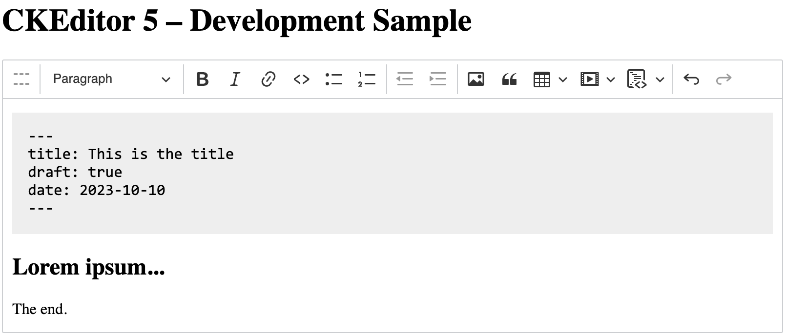

@witoso/ckeditor5-frontmatter
=============================



Experimental CKEditor 5 plugin for editing YAML frontmatter in Markdown documents.

The plugin is meant for Markdown workflows where a document may start with a metadata envelope, for example content rendered by static site generators:

```md
---
title: Hello
draft: false
tags: [ckeditor, markdown]
---

## Document body
```

## Usage

Add `Frontmatter` next to CKEditor 5's `Markdown` plugin:

```ts
import { ClassicEditor, Essentials, Markdown, Paragraph } from 'ckeditor5';
import { Frontmatter } from '@witoso/ckeditor5-frontmatter';

ClassicEditor.create( document.querySelector( '#editor' )!, {
	licenseKey: 'GPL',
	plugins: [
		Essentials,
		Markdown,
		Paragraph,
		Frontmatter
	],
	toolbar: [
		'frontmatter'
	]
} );
```

Use the standard CKEditor 5 data API:

```ts
editor.setData( `---
title: Hello
---

## Heading` );

const markdown = editor.getData();
```

The older `editor.setDataWithFrontmatter()` and `editor.getDataWithFrontmatter()` methods are still available as compatibility aliases, but new integrations should use `editor.setData()` and `editor.getData()`.

## Configuration

The `frontmatter` config can define fields inserted by the toolbar button and
the collapse behavior:

```ts
ClassicEditor.create( element, {
	// ...
	frontmatter: {
		defaults: new Map( [
			[ 'title', '' ],
			[ 'draft', 'true' ],
			[ 'date', '$currentDate' ]
		] ),
		collapsible: true
	}
} );
```

- `defaults` — fields prefilled when the frontmatter is inserted from the toolbar.
  `$currentDate` is expanded to the current local date in `YYYY-MM-DD` format.
- `collapsible` — when `true`, the frontmatter renders collapsed (`---` / `...` / `---`)
  and only shows its full content while hovered or while the selection is inside it.
  Defaults to `false`.

## Architecture

Frontmatter is handled as a file envelope around the Markdown body, not as regular Markdown content.

```txt
editor.setData( full markdown file )
        |
        v
FrontmatterDataProcessor
        |
        |  split document-start YAML envelope
        v
wrapped Markdown/GFM data processor
        |
        v
CKEditor view -> model
```

On output, the same wrapper delegates to the Markdown/GFM processor first, then serializes the frontmatter model back into a document-start YAML envelope.

```txt
CKEditor model -> view
        |
        v
wrapped Markdown/GFM data processor
        |
        v
FrontmatterDataProcessor
        |
        v
editor.getData() -> full markdown file
```

`FrontmatterEditing` installs the wrapper in `afterInit()`, so custom Markdown/GFM processor plugins can run first. The active processor composition is:

```txt
editor.data.processor
        |
        v
FrontmatterDataProcessor
        |
        v
custom Markdown/GFM processor, if any
        |
        v
CKEditor Markdown processor
```

Advanced integrations can access the wrapped processor through `FrontmatterDataProcessor#innerProcessor`.

## Caveats

* Only a document-start `---` block is treated as frontmatter.
* Copying and pasting frontmatter is not fully supported.
* Multi-root editors are not supported.
* The frontmatter parser preserves text and common Markdown escapes, but it does not validate YAML.

## Development

Install dependencies:

```bash
pnpm install
```

Start the Vite development sample with CKEditor Inspector attached:

```bash
pnpm start
```

Run tests:

```bash
pnpm run test
```

Run checks:

```bash
pnpm run lint
pnpm run stylelint
pnpm run build:types
```

Build the package:

```bash
pnpm run build
```

Synchronize translations:

```bash
pnpm run translations:synchronize
pnpm run translations:validate
```

## License

GPL-2.0-or-later. See [LICENSE.md](LICENSE.md).
